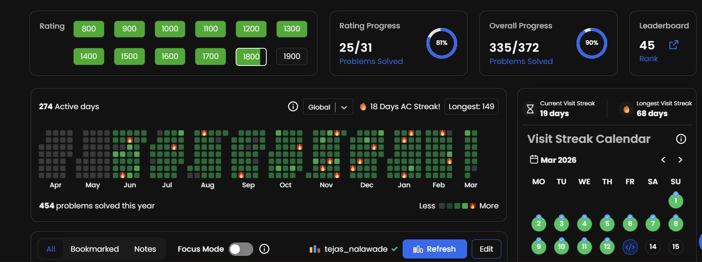

# CP-31 Sheet Practice

## Progress snapshot
Current progress (CP-31 dashboard):



This repository contains my C++ solutions for the CP-31 competitive programming sheet.

## What I am doing
- Solving problems daily from rating 800 to 1900.
- Improving logic and implementation speed.
- Writing clean, simple C++ code.
- Reducing Time Limit Exceeded (TLE) by optimizing each solution.

## Main objective
The goal is not only to get accepted answers, but also to learn how to move from slower ideas to efficient solutions.

## How I solve TLE
- Check time complexity before coding.
- Replace brute force with better patterns when needed.
- Prefer O(n) or O(n log n) solutions for large constraints.
- Use common CP techniques: prefix sums, sorting, binary search, two pointers, greedy, maps/sets.
- Keep input/output fast and code minimal.

## Folder structure
Problems are grouped by rating:
- 800/
- 900/
- 1000/
- ...
- 1900/

Each file is one solved problem from the sheet.

## File style
- Language: C++17
- Focus: simple, readable, contest-friendly code
- Naming: numbered files per rating folder

## Local run example (Windows PowerShell)
```bash
g++ -std=c++17 -O2 -Wall -Wextra -o main "1000/01-Swap-and-Delete.cpp"
.\main.exe
```

## Progress mindset
- Solve
- Optimize
- Learn pattern
- Revisit if solution is slow

This repository is my CP-31 learning log focused on consistency and performance.
